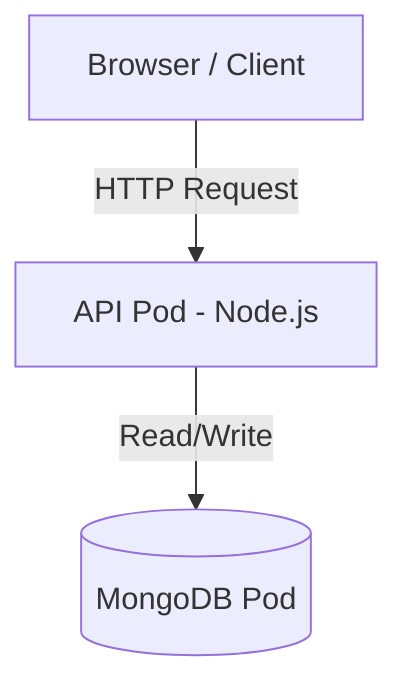

# Kitchen Order API - Docker & Kubernetes Deployment

## Overview
This project demonstrates a containerized Node.js API deployed using Docker and Kubernetes. The application allows users to create and view kitchen orders seamlessly, backed by a persistent MongoDB database.

## Architecture



## Technologies Used
- **Node.js**: Backend framework for building the REST API
- **MongoDB**: NoSQL database for flexible data storage
- **Docker**: Containerization and image builds (`docker-compose` included)
- **Kubernetes**: Container orchestration utilizing `kind` for local testing
- **GitHub Actions**: Continuous Integration pipeline configs

## API Endpoints

### 1. Health Check
Checks if the application is running correctly.
- **Request:** `GET /health`
- **Response:** `200 OK`

### 2. Create Order
Creates a new kitchen order in the database.
- **Request:** `POST /orders`
- **Body:**
  ```json
  {
    "dish": "Dosai"
  }
  ```

### 3. List Orders
Retrieves all kitchen orders from the database.
- **Request:** `GET /orders`
- **Response:** Returns an array of order objects.

---

## Running Locally

### Option 1: Using Docker Compose
The fastest way to get both the API and the Database up and running locally.

1. Ensure Docker Desktop or Docker Engine is running on your machine.
2. Build and start the services exactly as specified in `docker-compose.yml`:
   ```bash
   docker compose up -d --build
   ```
3. Test it out by hitting the health check:
   ```bash
   curl http://localhost:3000/health
   ```
4. Shut down the application when you're done:
   ```bash
   docker compose down
   ```

### Option 2: Using Kubernetes (Kind)
For testing Kubernetes deployments directly matching production configurations.

1. Make sure you have `kind` and `kubectl` configured.
2. Build your local Docker image:
   ```bash
   docker build -t kitchen-api:local ./api
   ```
3. Load the image into your Kind cluster:
   ```bash
   kind load docker-image kitchen-api:local
   ```
4. Deploy the Kubernetes manifests (in order):
   ```bash
   kubectl apply -f k8s/namespace.yaml
   kubectl apply -f k8s/db/
   kubectl apply -f k8s/api/
   kubectl apply -f k8s/web-ui/  # Optional: if UI manifests are available
   ```
5. Check your deployment status:
   ```bash
   kubectl get pods -n kitchen
   ```
